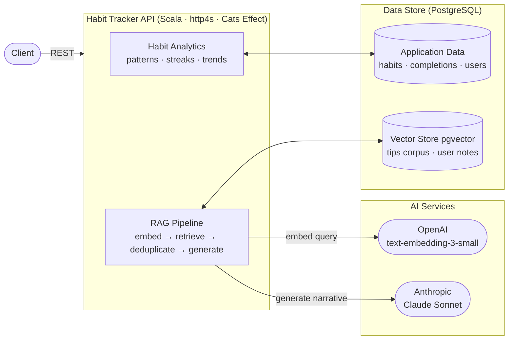
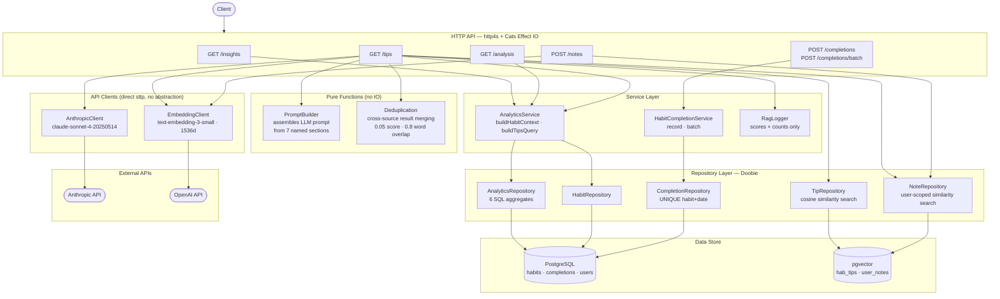
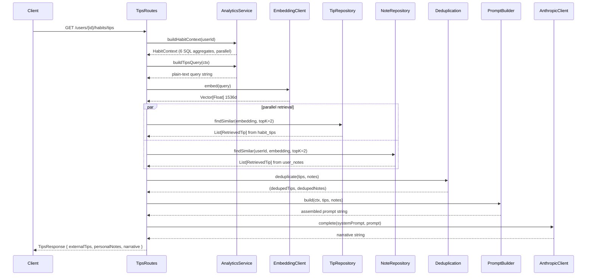

# Architecture Diagram

## High-Level Architecture

```mermaid
graph LR
    Client(["Client"])

    subgraph Backend ["Habit Tracker API  (Scala · http4s · Cats Effect)"]
        direction TB
        Analytics["Habit Analytics\npatterns · streaks · trends"]
        RAG["RAG Pipeline\nembed → retrieve → deduplicate → generate"]
    end

    subgraph Data ["Data Store  (PostgreSQL)"]
        direction TB
        AppDB[("Application Data\nhabits · completions · users")]
        VectorDB[("Vector Store  pgvector\ntips corpus · user notes")]
    end

    subgraph AI ["AI Services"]
        direction TB
        OpenAI(["OpenAI\ntext-embedding-3-small"])
        Anthropic(["Anthropic\nClaude Sonnet"])
    end

    Client -->|"REST"| Backend
    Analytics <--> AppDB
    RAG <--> VectorDB
    RAG -->|"embed query"| OpenAI
    RAG -->|"generate narrative"| Anthropic
```

---

## System Architecture

```mermaid
graph TB
    Client(["Client"])

    subgraph API ["HTTP API — http4s + Cats Effect IO"]
        Insights["GET /insights"]
        Analysis["GET /analysis"]
        Tips["GET /tips"]
        Notes["POST /notes"]
        Completions["POST /completions\nPOST /completions/batch"]
    end

    subgraph Pure ["Pure Functions (no IO)"]
        PB["PromptBuilder\nassembles LLM prompt\nfrom 7 named sections"]
        DD["Deduplication\ncross-source result merging\n0.05 score · 0.8 word overlap"]
    end

    subgraph Services ["Service Layer"]
        AS["AnalyticsService\nbuildHabitContext · buildTipsQuery"]
        CS["HabitCompletionService\nrecord · batch"]
        RL["RagLogger\nscores + counts only"]
    end

    subgraph Clients ["API Clients (direct sttp, no abstraction)"]
        AC["AnthropicClient\nclaude-sonnet-4-20250514"]
        EC["EmbeddingClient\ntext-embedding-3-small · 1536d"]
    end

    subgraph Repos ["Repository Layer — Doobie"]
        HR["HabitRepository"]
        AR["AnalyticsRepository\n6 SQL aggregates"]
        CR["CompletionRepository\nUNIQUE habit+date"]
        TR["TipRepository\ncosine similarity search"]
        NR["NoteRepository\nuser-scoped similarity search"]
    end

    subgraph External ["External APIs"]
        ANT(["Anthropic API"])
        OAI(["OpenAI API"])
    end

    subgraph Store ["Data Store"]
        PG[("PostgreSQL\nhabits · completions · users")]
        PGV[("pgvector\nhab_tips · user_notes")]
    end

    Client --> API

    Insights --> AS
    Analysis --> AS
    Tips     --> AS
    Tips     --> EC
    Tips     --> TR
    Tips     --> NR
    Tips     --> DD
    Tips     --> PB
    Tips     --> AC
    Tips     --> RL
    Notes    --> EC
    Notes    --> NR
    Completions --> CS

    AS --> AR
    AS --> HR
    CS --> CR

    AC --> ANT
    EC --> OAI

    AR --> PG
    HR --> PG
    CR --> PG
    TR --> PGV
    NR --> PGV
```

---

## RAG Pipeline — GET /tips

```mermaid
sequenceDiagram
    participant C as Client
    participant R as TipsRoutes
    participant S as AnalyticsService
    participant E as EmbeddingClient
    participant T as TipRepository
    participant N as NoteRepository
    participant D as Deduplication
    participant P as PromptBuilder
    participant A as AnthropicClient

    C->>R: GET /users/{id}/habits/tips
    R->>S: buildHabitContext(userId)
    S-->>R: HabitContext (6 SQL aggregates, parallel)
    R->>S: buildTipsQuery(ctx)
    S-->>R: plain-text query string
    R->>E: embed(query)
    E-->>R: Vector[Float] 1536d

    par parallel retrieval
        R->>T: findSimilar(embedding, topK=2)
        T-->>R: List[RetrievedTip] from habit_tips
    and
        R->>N: findSimilar(userId, embedding, topK=2)
        N-->>R: List[RetrievedTip] from user_notes
    end

    R->>D: deduplicate(tips, notes)
    D-->>R: (dedupedTips, dedupedNotes)
    R->>P: build(ctx, tips, notes)
    P-->>R: assembled prompt string
    R->>A: complete(systemPrompt, prompt)
    A-->>R: narrative string
    R-->>C: TipsResponse { externalTips, personalNotes, narrative }
```
